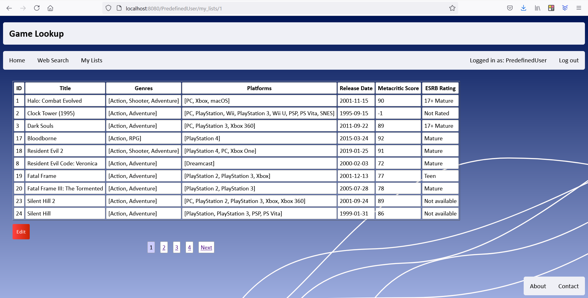

# game-lookup
Full stack web application using Spring Boot to manage video game collections with an added search function

# How-To
1. Clone the repo
2. Start MySQL 8
3. Enter your rawg.io API key and MySQL user credentials into the application.properties file  
(This is needed for the web search feature, you can get an API key from here https://rawg.io/apidocs)
4. Import the project to your IDE as a maven project
5. Run the GameLookupApplication class
6. Open up your browser and navigate to localhost:8080
7. Log-in using username: "user", password: "password" (alternatively, add a new user, either using the sign up form or simply add one to the database in the DataLoader class)

Note: An internet connection is required to use the web search feature  

# Screenshots  
## Login/Signup  
  

  

## Web Search
  
  
## Web Search entry selection
  

## My lists
  

## Detailed list view
  

## Detailed list edit entries
